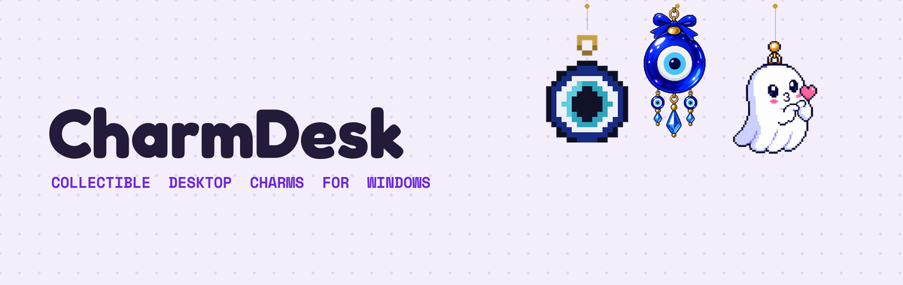
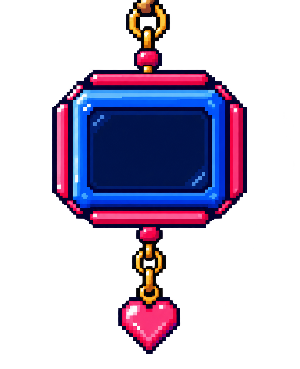

<div align="center">



[](#)
[](#)
[](LICENSE)
[](#)

**Little pixel-art charms that hang off the edge of your desktop and swing like the real thing.**

</div>

---

CharmDesk pins a collectible charm — a gilded evil eye, a ghost, whatever you add next — to the top
of your screen. Grab it with your mouse, pull it, let go, and it swings and settles like an
actual object on a string, not a CSS animation pretending to be one. It sits quietly in the
system tray the rest of the time.

## Why

Phone charms and bag charms are everywhere right now. Desktops don't get to have any. CharmDesk
is a small, honest attempt to fix that — a hanging ornament for the one screen you look at all
day, built as a real physics simulation instead of a sprite that jiggles on a timer.

## Features

- **Physical, not animated.** A polar pendulum-spring simulation drives every swing — grab
  momentum, gravity, damping, and secondary string motion all fall out of the same simulation,
  free-swinging and cursor-grabbed alike.
- **Actually transparent.** The overlay is click-through everywhere except the charm itself, so
  it never steals a click meant for your desktop or the app underneath it.
- **A real charm library.** Every charm is its own package — a folder with a `manifest.json` and
  a transparent PNG. Nothing about a charm is hardcoded into the engine.
- **A local Charm Manager.** Import a PNG, tune its physics on live sliders, preview the drag
  feel, save. No source changes, no rebuild.
- **Lives in the tray.** Show/hide, switch charms, reposition, or quit — right-click the charm
  itself or the tray icon for the same menu.

## The collection so far

<table>
<tr>
<td align="center" width="33%"><br><b>Timekeeper</b><br><sub>Flagship - live clock</sub></td>
<td align="center" width="33%"><br><b>Gilded Evil Eye</b><br><sub>Traditional</sub></td>
<td align="center" width="33%"><br><b>Boo</b><br><sub>Cute</sub></td>
</tr>
</table>

**Timekeeper** is the one charm with a reason to stay on your desktop beyond looks: a live
clock rendered on top of the charm art in real time (not baked into the image), so it swings,
spins, and tells the actual time. See [Live-rendered charms](#live-rendered-charms) below for
how that works.

## Building a charm package

A charm is just a folder — drop one into your charm library folder and CharmDesk picks it up on
next launch, no code involved:

```text
charms/
  cute-ghost/
    manifest.json
    charm.png        # transparent PNG, pixel art recommended
    thumbnail.png
```

```json
{
  "id": "cute-ghost",
  "name": "Boo",
  "description": "A friendly little ghost with a heart to give away.",
  "category": "Cute",
  "image": "charm.png",
  "thumbnail": "thumbnail.png",
  "enabled": true,
  "displayScale": 1.0,
  "reactionStyle": "Playful",
  "physics": {
    "stringLength": 118,
    "gravity": 980,
    "damping": 0.94,
    "stiffness": 0.15,
    "mass": 0.85
  }
}
```

Every physics value is per-charm — a heavier charm drags differently than a light one. The
in-app Charm Manager writes exactly this file for you, if you'd rather not hand-edit JSON.

## Live-rendered charms

Every charm above is a static image. Timekeeper isn't — its art is a blank display face, and
`manifest.json` declares a `clockFace.digital` region (position, size, colors) in the source
image's own pixel coordinates. At runtime `CharmWindow` draws live text into that region on a
dedicated 1Hz timer, independent of the 60fps physics loop, so the clock keeps ticking even
while the charm is sitting still (and the physics loop is allowed to sleep). The text layer
lives inside the same transform as the charm image, so it inherits the pendulum's position and
spin automatically — it swings and does a 360° with the rest of the charm on a double-click,
exactly like a normal charm, with zero interaction code written specifically for it.

```json
"clockFace": {
  "digital": {
    "x": 296, "y": 305, "width": 424, "height": 351,
    "showDate": true,
    "timeColor": "#5FD4FF", "dateColor": "#3E8FB0"
  }
}
```

Any charm can opt into this the same way; nothing else changes. It's a small, deliberately
narrow mechanism (one region type, digital text) rather than a general plugin system — easy to
extend later (an analog hands layer, say) if a second live charm actually needs it.

## Getting started

Requires the [.NET 8 SDK](https://dotnet.microsoft.com/download/dotnet/8.0) and Windows 10/11.

```bash
git clone https://github.com/Organic42/CharmDesk.git
cd CharmDesk/src
dotnet build CharmDesk.sln -c Release
dotnet run --project CharmDesk
```

To publish a standalone build:

```bash
dotnet publish CharmDesk/CharmDesk.csproj -c Release -o ./out
```

This produces a framework-dependent build (a few MB, requires the .NET 8 Desktop Runtime on the
target machine) — the right shape for Microsoft Store distribution, where the runtime ships as
an automatic dependency.

## How it's built

Native WPF + a thin sliver of WinForms (tray icon, monitor enumeration only) — no Electron, no
web view. Chosen specifically for real per-pixel transparent windows, proper click-through
hit-testing, and a system tray that doesn't need a browser runtime behind it.

```text
Core/            physics engine, charm manifest model, interaction system
Native/          Win32 interop - click-through toggling, the global mouse-position hook
                 that makes click-through recoverable, DPI/monitor helpers
Persistence/     settings + logging, both plain JSON/text files
Tray/            the system tray icon and its shared context menu
Windows/         the desktop overlay, Charm Library, Charm Manager, Settings
```

The trickiest bit: a `WS_EX_TRANSPARENT` window is excluded from mouse hit-testing
*unconditionally*, not just over transparent pixels — so once the overlay goes click-through, it
can never see a mouse event again to know the cursor came back. A lightweight low-level mouse
hook watches cursor position independently of that state, purely to catch the one "cursor
entered the charm" transition; everything after runs through normal WPF input.

## Roadmap

- [x] Core physics + drag interaction
- [x] Charm Library, Manager, Settings
- [x] Framework-dependent, trimmed-down publish
- [x] MSIX packaging (see [packaging/](packaging/)) - builds and installs locally; Store submission needs a real Partner Center identity swapped in
- [ ] Store listing (icons, screenshots, privacy policy)

## Contributing

Issues and PRs welcome. If you build a charm you like, a PR adding it to `charms/` is the easiest
way to get it into the collection.

## License

[MIT](LICENSE) — see the license file for the full text.
